# Chapter 1. A Memory-centric System Model

Chapter 1 introduces embedded systems from a high-level hardware and software perspective. We cover basic systems built on microcontroller-based architectures before moving to SoC-based designs.

###### In this first chapter, we will review the basics of a computer system.

## 1.1. Global Computing Systems

Nowadays, computing is pervasive throughout the entire world:
- Wide area network
- Cloud computing
- Servers
- IoT
- ...

The expandsion of IoT is one of the new technology revolutions, also including the field of robotics, automotive, AI,... with many areas of research and numerous new industrial products.

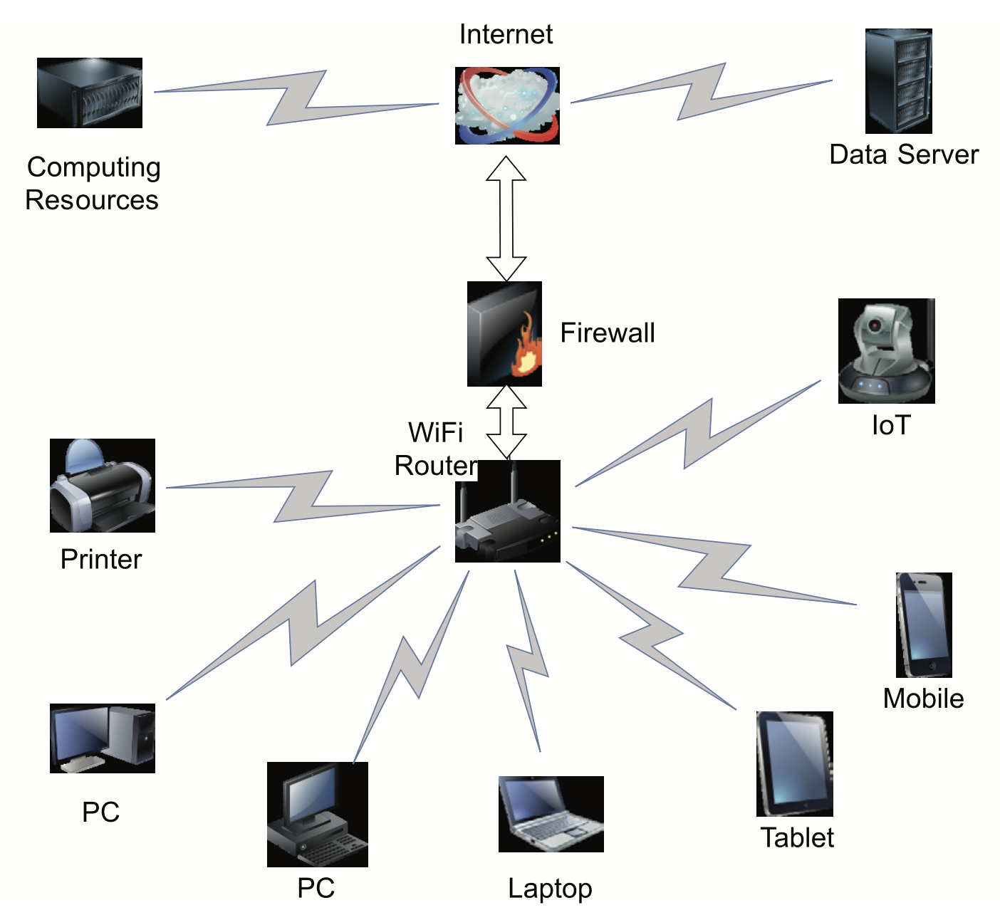

However, the majority of this technology is hidden from the average human user. Typically, large servers will have thousands of processing units in form of microprocessors together with huge amounts of memory and specific accelerators (GPUs, FPGAs,...).

## 1.2. General Computer Architecture

Computer architecture at the hardware level is a system composed basic elements:
- __Processor(s)__ or __Microprocessor(s)__ for data management and program execution.
- __Memories__ for code, data, and operational (stack, heap,...) storage.
- __I/O devices__ for comunication with internal facilities and external world though __programmable interfaces__.

Connection between these elements:
- __Address bus__ is used to specify which requestor unit to access and which element within this unit.
- __Data bus__ is used to tranfer data between a requestor unit and a completer unit.
- __Control bus__ is used to specify what to do: the direction of data transfers (read or write) from the requestor unit's POV and when to do it in terms of timing.

Other mandatory functions and signals are also requires such as __clock__ to synchonize data transfers, a __reset__ to initialize the system, __power supply__ lines, __interrupt__ lines.

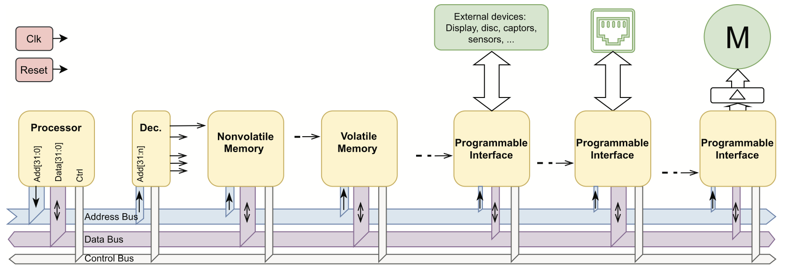

The processor provides an address to select a device and indicates a memory position or programmable interface internal register.

The control bus is used to provice the direction of the access (read or write).

The decoder receives the upper part of the address and can select a specific unit of memory or a programmable interface to access; it generates a signal called Chip Select (CE) to enable execlusive access to one device at a time.

The selected device will accept the data provided by the processor (in write cycle) or provide the data requested on the data bus (for a read access). The direction is always taken from the POV of the requestor, which is the processor in this case.

In a general computer, all elements are specific and separated in different integrated circuits. However, increasing miniaturization means that most of them can now be made available in a single die: a __microcontroller__.

## 1.3. Embedded System Architectures

An embedded system is a specialized computer designed for a specific application. Such system are usually designed to reduce the cost of production, and are designed from the hardware level up to the software level.

Examples of embedded systems:
- Coffee machines with panels for control of the machine
- Anti-lock braking systems (ABS) on cars
- Cameras
- Mobile/static robots
- ...

However, the hardware alone is not enough. On top of it, we must have a software application based on a kernel and/or simplified operating system (RTOS) that manages all of the resources, memory, time management,...

Above low-level software may sit libraries of useful functions, such as GUIs, network protocols, singal processing,...

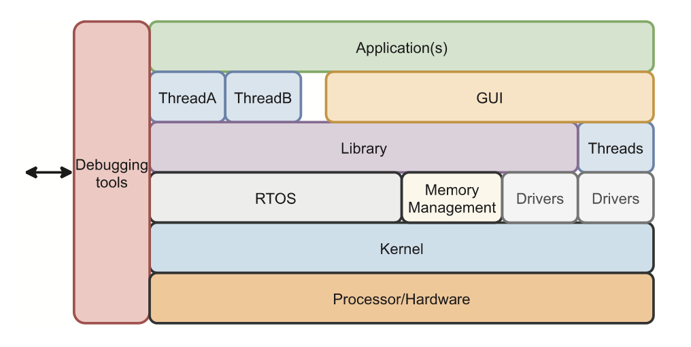

## 1.4. Embedded SoC Architectures

A system on chip (SoC) is simply every elements of a computer on a single integrated circut.

Many manufacturers make the same or very similar programmable interfaces available with many diffirent processors and memory configurations. Thus, we have diffirent layers of users:
- __Application users__ want a finished product, don't care about the technology. They just want it to be powerful in terms of what they want to do with it.
- __Product designer__ can realize and choose product from thousands of devices from hundreds of manufacturers.
- __Designers of the SoC__ itself.
- __IP designers__ of the processor architecture who need to create a new generation of it or develop specialized modules.
- ...

## 1.5. Elements of SoC Solutions

When an engineer has to design a new SoC solution, they need to think about the key elements to be used and/or developed:
- Computing power
- Electical power
- Battery or External power
- Bandwidth of data
- Communications
- Memory type & size
- Connectors
- ...

### 1.5.1. Processor Cores

Main selection criteria:
- Size of data/address bus (4, 8, 16,... bits of data path)
- Number of units inside a processor

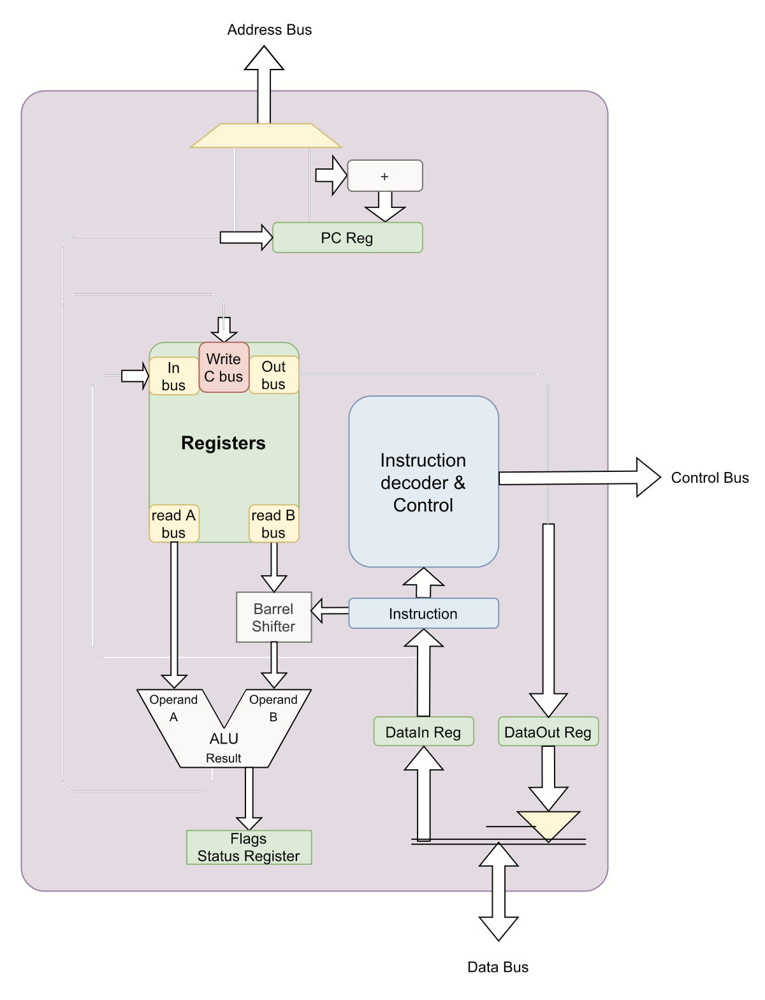

### 1.5.2. Registers and Control Unit

Register are used as sources and destinations for data to save and execute the operations. These could be simple and unique but as in some cases, many banks of register might exist.

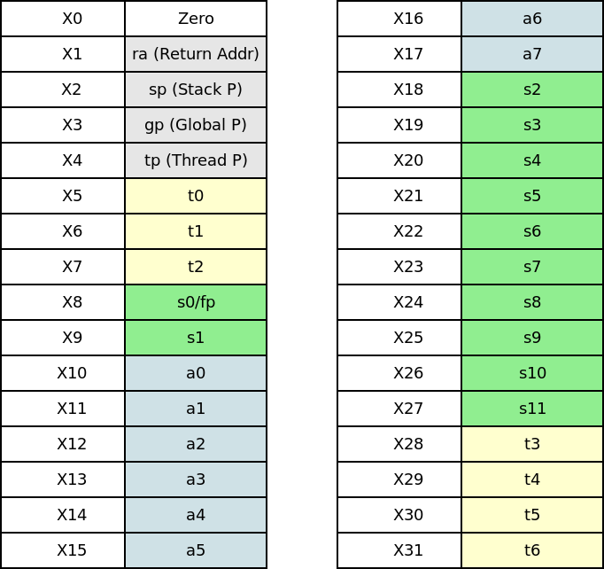

Some processors may have particular register called __flags__, which holds status of operations from the ALU.

Example of 8086 (and almost all processors)'s flags register:
- __Carry flag__ (C) indicate when an arithmetic carry or borrow has been generated out of the most significant arithmetic logic unit (ALU) bit position.
- __Parity flag__ (P) indicates if the numbers of set bits is odd or even in the binary representation of the result of the last operation.
- __Auxiliary flag__ (A) indicates when a carry or borrow has been generated out of the least significant four bits of the accumulator register following the execution of an arithmetic instruction. It is primarily used in decimal (BCD) arithmetic instructions.
- __Zero flag__ (Z) is used to check the result of an arithmetic operation, including bitwise logical instructions. It is set to 1, or true, if an arithmetic result is zero, and reset to 0, or flase otherwise.
- __Sign flag__ (S) indicates whether the result of the last mathematical operation produced a value in which the most significant bit (the left most bit) was 1 (negative sign in signed number).
- ...

The instruction are coded in memory as binary. They have specific format and depend on the processor family, which mean a given binary code can only be executed on a specific processor architecture.

To access the current code, it is necessary to know where the next instruction is, read, decode, execute in sequence. To provide this address, a specific register called __Program Counter__ (PC) is usually used. Its content is passed to the external address bus to select the instruction from memory. The PC is automatically incremented according to the size of the instruction.

When branching (jumping) in program, a new address must be loaded from the code of the instruction or the content of a global register or via some other operation to store in to the PC, which is the address from which to read the next instruction.

The data retrieved from the memory is passed to the __Instruction Register__ to be decoded by the __Instruction Decoder__ & __Controller__ so the __Control Unit__ can decides what to do, which register to access, which ALU operation to execute,...

In term or a simple processor, every step of an instruction is completed before a new one is started. However, this is not very efficient.

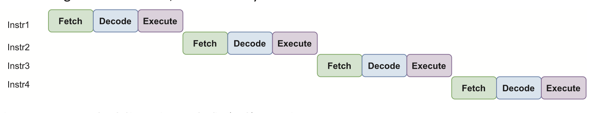

A better approach is __pipelining__ the design, as soon as an instruction has been fetched into the internal instruction register, a new instruction can be fetched while the first one is being decoded, and so on...

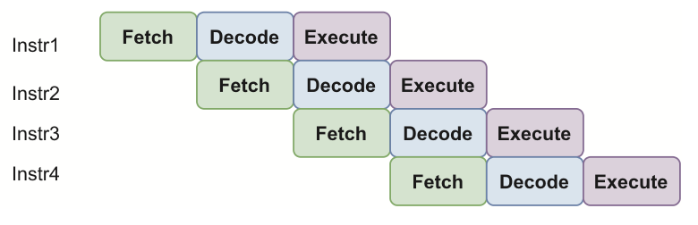

However, this kind of parallelism does have some problems for like, if a program branch or jump instruction has to be executed, the address of the next instruction will only known when the execution of the previous one has completed. So in this case, the next fetch must be delayed.

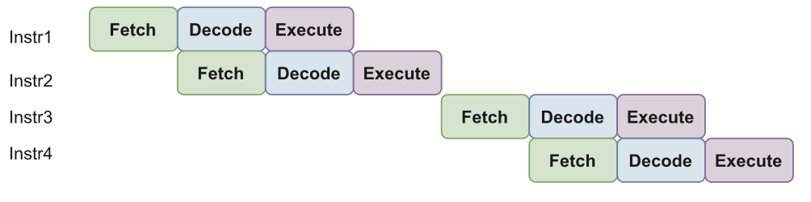

To transfer data __in__ and __out__ of the processor, 2 specific buffers access the external data bus. Sometimes a bidirectional buffer is used, with a tri-state buffer allowing the direction of transfer to be differentiated.

The data to transfer can be vary:
- Instruction
- Access to a variable in memory
- Access to a programmable interface
- etc, any thing that can provide or receive data...

__Von Neumann__ archtitecture uses a __unified memory space__, holding both instructions & data. The __same bus is shared__ for reading instruction and accessing data. Using common bus like that __reduces physical lines__, __allows shared bus to be wide__, but __instructions & data must be transfers in a sequence__, creating a bottleneck and __reducing thoughput__.

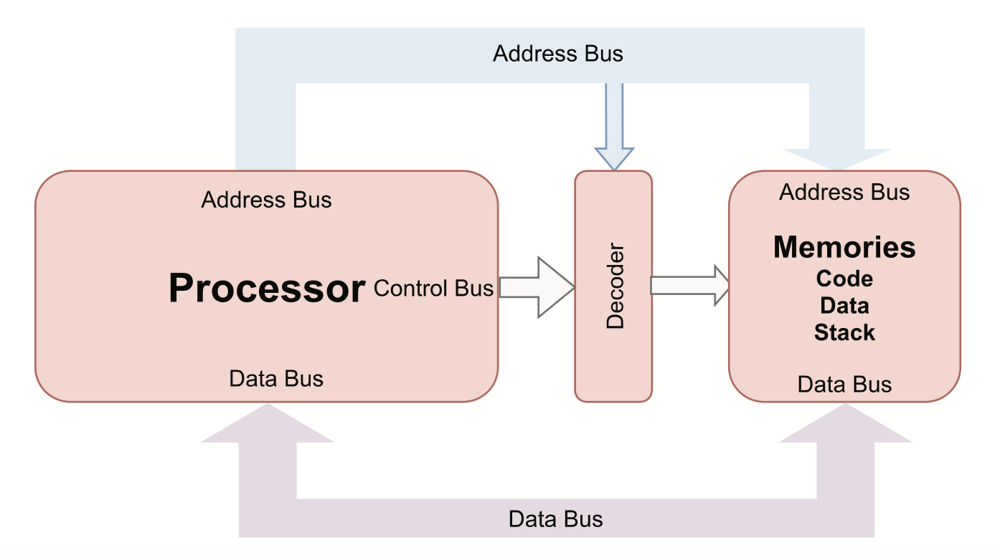

__Harvard architecture__ is an alternative architecture, more powerful in terms of __compute efficiency__. __Seperated address & data buses__, which make the bus doubled up and has a __cost in terms of complexity and physical lines__. However, it allows the reading of a new instruction to be done __at the same time__ as a data transfer.

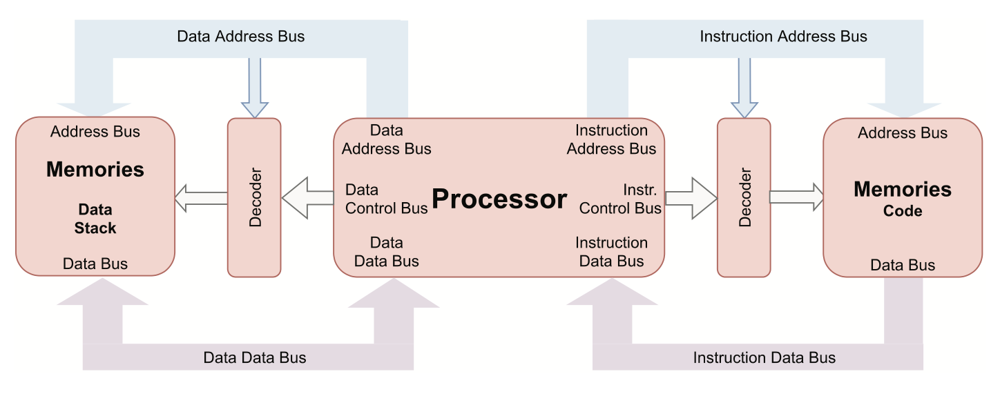

### 1.5.3. Memory

Memory can be viewed as a large number of seperated drawers, each with its own identification number, starting from 0 and increasing thereafter. The next step is to create __memory map__, a model of the memories available on a system. Regardless of whether the memory is internal or external to the microcontroller, the memory map model will be the same.

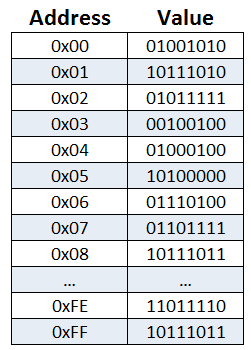

To design a SoC must determine:
- Address space available (range of memory address that can be accessed).
- Data bus width
- Type of memory:
  - Volatile/Non-volatile
  - Static/Dynamic
  - Asynchronous/Synchronous
- Control singal needed
- ...

Memory mapping process:
- When Power Up or after a Reset, start executing code from boot(strap) code section, which needs to be immediately available.
- Need a few megabytes of static memory (SRAM) that can be read from and written to.
- ...

### 1.5.4. Memory Classes

When memory is needed, there are many different models to choose from

#### 1.5.4.1. Nonvolatile/volatile memory

##### a) Nonvolatile memory

When power goes down, the content of the memory is not lost and is available again at power up. This is mandatory for boot code used when a processor starts or restarts.

###### ROM:
Read-only memory; the content of this memory is defined during the manufacturing of the device. In the case of error, the chip is effectively rendered unusable.

###### PROM:
Programmable ROM; the content can be programmed with a specific piece of hardware called a memory programmer. The content can only be programmed once.

###### EPROM (Erasable PROM):
like a PROM, could be programmed through specific programmer hardware, but a quartz window was installed on the top of the device and it was also possible to erase the memory via UV light, although it was necessary to remove the device from its board for erasure and reprogramming.

###### EEPROM (Electrically erasable PROM):
Advance on EPROM, one could now program the memory directly on the board and rewrite its content by electrical erasure byte by byte. Low density and expensive, but still used today inside some microcontrollers for memory of limited size.

###### Flash Memory:
EEPROM-based, NAND-type flash memory can be erased in blocks (the NOR-type works at word-level) and rewritten in situ using an appropriate protocol and a standard voltage. Commonly available in sizes of many gigabytes, it is routinely used in USB memory sticks and SD cards for cameras, and can be used by almost all microcontrollers.

###### FRAM, MRAM, PRAM, ReRAM, FeFET

##### b) Volatile memory

When power goes down, the content of volatile memory is lost. It can be static or dynamic. If the latter, it is necessary to periodically refresh the memory content.

###### SRAM (Static RAM):
This is the basic form of volatile RAM, available up to a few megabytes. Four transistors are needed to memorize a bit of information, plus two more to access the content during read or write access.

##### SSRAM (Synchronous SRAM):
Access is synchronized via a clock.

##### DRAM (Dynamic RAM):
The main idea behind DRAM is to make use of a memory element based on a single transistor to memorize and access a bit of information. The performance gain is huge (approximately fourfold compared to SRAM) but it is necessary to refresh the full memory every few milliseconds! Access is conducted in two steps: selection of a row of bits and then of the column in the selected row. The data is arranged in a matrix-like format.

###### SDRAM (Synchronous DRAM):
Uses the same principle as DRAM but with clock-controlled synchronous access.

###### DDR SDRAM (Dual data rate SDRAM), GDDR (SDRAM) (Graphical DDR), LPDDR (Low-power DDR), QDR (SDRAM) (Quad data rate)

Volatile memory can be further classified according to whether data access is synchronous or asynchronous:
- Asynchronous: No clock is used. The RAM family has some devices without a clock; they conduct asynchronous access.
- Synchronous: Memory access is clock-based; more recent RAM solutions use a clock to synchronize data transfers.

Data access to transfer addresses and data can be done in parallel or in serial:
- Parallel data access: In a parallel bus, all of the address and data lines are available, which enables the processor to execute code and access data directly with a very fast transfer rate between memory and the processor; less than ten nanoseconds for transfer of an entire (multi-bit) word. Note that some devices multiplex these lines.
- Serial data access: When the number of lines used to transfer addresses and data must be limited, serial access to memory (one bit at a time) is a sensible option. Memories used on SD cards and USB sticks use this approach. Information transfer is done with a serial bus in the form of SPI (Serial Peripheral Interface) or a QSPI (Queued SPI) controller. Alternative protocols include USB (fast) and I2C (low-speed protocol for multiple peripherals).

Addressing can also be approached in two different ways:
- Parallel addressing for direct access: To access a memory position the full address is transferred in parallel (to cover many bits of the address). Sometimes the address is provided in two steps as for DRAM (see above): first to specify the row address, then the column address.
- Streaming access: The first address accessed in memory is transferred, after which the address is automatically incremented, and the data is transferred to/from the next contiguous address, and so on.

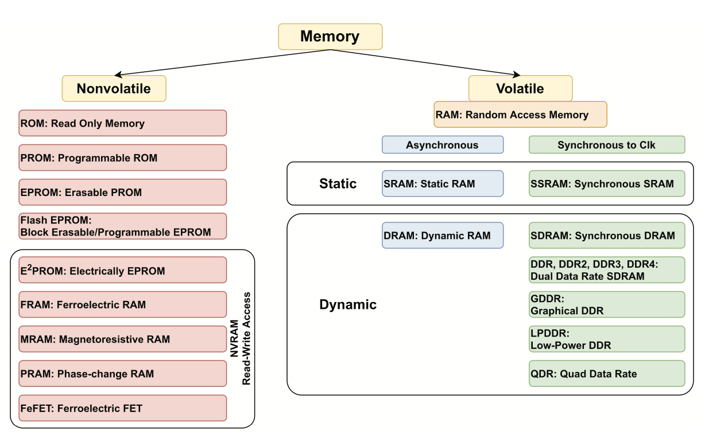

### 1.5.5. Internal Memory Organization

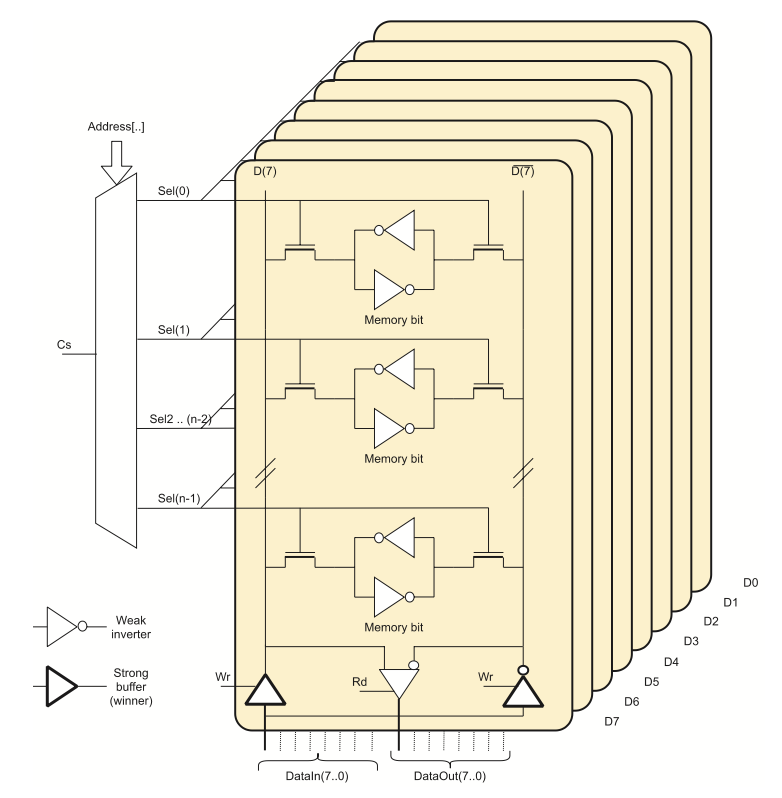

The memory cell is represented by two inverters. Two transistors are used as a gate to transfer the data bit from two vertical lines, D and D'

### 1.5.6. Interrupt Controllers

### 1.5.7. Memory Protection Unit (MPU)/Memory Management Unit (MMU)

### 1.5.8. Interconnects

## 1.6. System Architecture and Complexity

## 1.7. Software for Embedded System Development

## 1.8. Summary